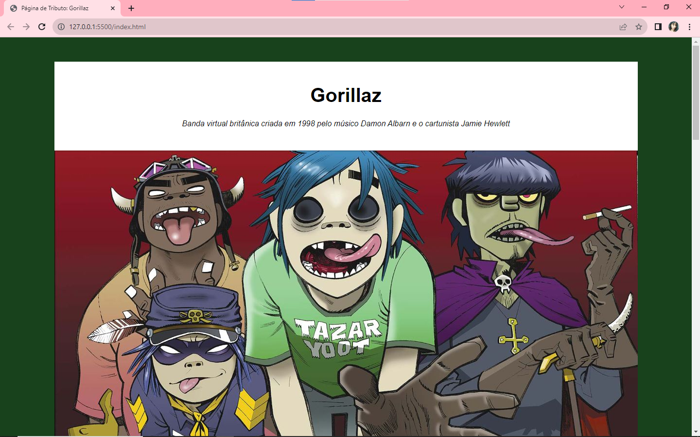
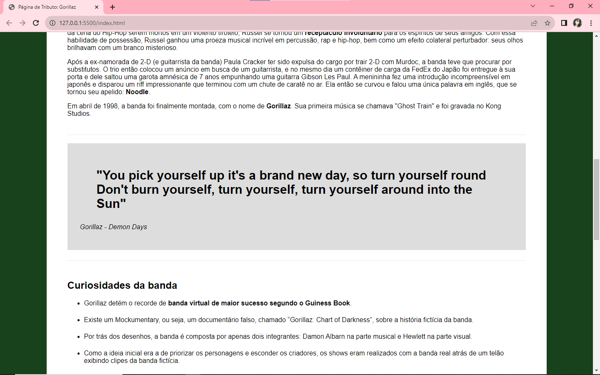

# Página de Tributo / Tribute Page

## 🔹 Project description
Desenvolvimento de uma página de tributo para a banda virtual Gorillaz. Um simples projeto desenvolvido para fixar os conceitos de HTML e CSS estudados.

Development of a tribute page for the virtual band Gorillaz. A simple project developed to consolidate the HTML and CSS concepts studied.
## ⚙ Functionalities
A página apenas apresenta sessões de apresentação da banda, curiosidades e trechos de músicas, além de direcionamento a outras páginas mais completas, sem nenhuma funcionalidade além de informar o usuário.

The page only features band presentation sessions, curiosities and song excerpts, in addition to directing you to other more complete pages, without any functionality other than informing the user.

## 📚 Languages, dependencies and libraries 
HTML, CSS, Developed in Visual Studio Code IDE.

## Developer:
Maria Eduarda Cardoso de Souza, meduardacardoso.121@gmail.com.

## License
The MIT License (MIT)

## Copyright ©️ 2023 - Tribute Page
